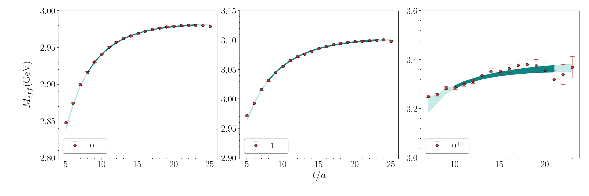
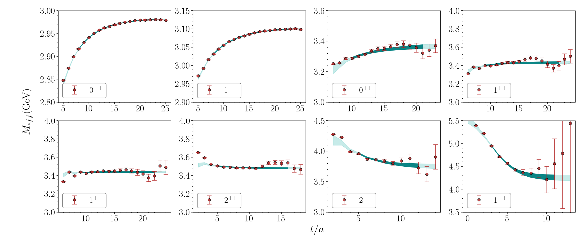
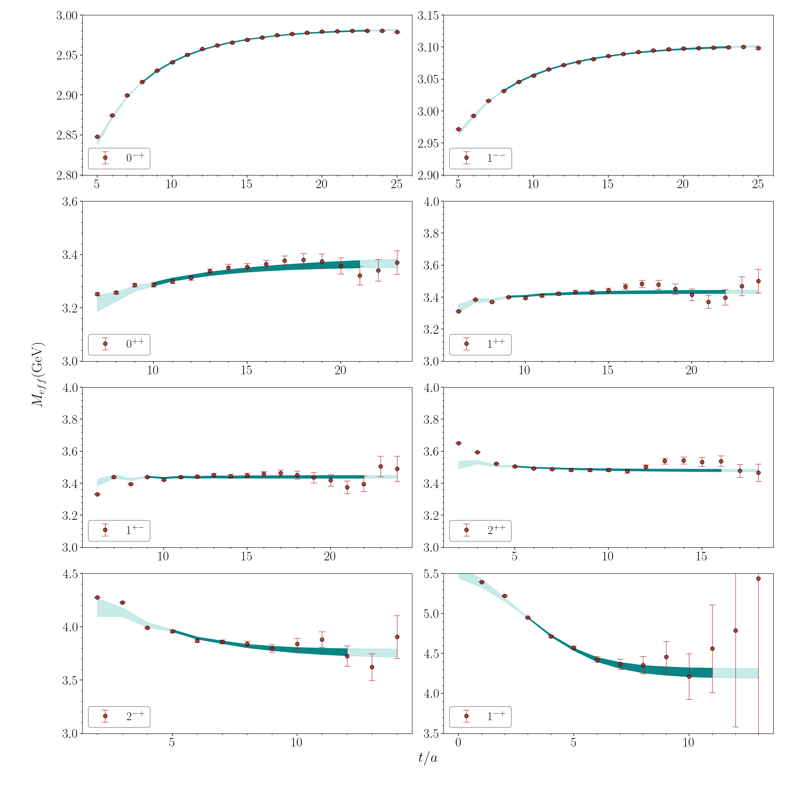

Effective mass with best fit parameters (color band) and raw data with jackknife error (points with errorbar) for $32^3\times 64$ lattice.
Moreover, the dark color band indicates the fitting range.

**data** directory contains the effective mass results from raw two point functions data 
(1th column mean and 2th column error) and two point functions with best fit parameters (3th column mean and 4th column error) on
$32^3\times64$ lattice.

Run `./plot_subplot.py -h` to learn the usage:
```
usage: plot_subplot.py [-h] [-i INFILE [INFILE ...]] [-o OUTFILE] [-x XLABEL]
                       [-y YLABEL] [-subplot SUBPLOT SUBPLOT]
                       [-figsize FIGSIZE FIGSIZE]

optional arguments:
  -h, --help            show this help message and exit
  -i INFILE [INFILE ...], --infile INFILE [INFILE ...]
  -o OUTFILE, --outfile OUTFILE
  -x XLABEL, --xlabel XLABEL
                        x-axis label of the plot (default: $t/a_t$)
  -y YLABEL, --ylabel YLABEL
                        y-axis label of the plot (default: $m_{eff}(t)$)
  -subplot SUBPLOT SUBPLOT, --subplot SUBPLOT SUBPLOT
                        the number of rows and columns of subplot layout
                        (default: [1, 1])
  -figsize FIGSIZE FIGSIZE, --figsize FIGSIZE FIGSIZE
                        the figure size of subplot (default: [16, 9])
```
where the output shows the command line options and is self-explainable.

- plot a single $0^{-+}$ channel
  ```
  ./plot_subplot.py -i data/Effem_0-+.dat -o output/Effem_32_subplot_0-+ -x "\$t/a\$" -y "\$M_{eff}(\mathrm{GeV})\$" -subplot 1 1 -figsize 10 8
  ```
  
- plot $0^{-+}, 1^{--}, 0^{++}$ as 1 by 3 subplot
  ```
  ./plot_subplot.py -i data/Effem_{0-+,1--,0++}.dat -o output/Effem_32_subplot_1by3 -x "\$t/a\$" -y "\$M_{eff}(\mathrm{GeV})\$" -subplot 1 3 -figsize 21 7
  ```
  
- plot all the channels into 2 by 4 subplot
  ```
  ./plot_subplot.py -i data/Effem_{0-+,1--,0++,1++,1+-,2++,2-+,1-+}.dat -o output/Effem_32_subplot_all_2_4 -x "\$t/a\$" -y "\$M_{eff}(\mathrm{GeV})\$" -subplot 2 4 -figsize 21 9
  ```
  
- or plot all the channels into 4 by 2 subplot
  ```
  ./plot_subplot.py -i data/Effem_{0-+,1--,0++,1++,1+-,2++,2-+,1-+}.dat -o output/Effem_32_subplot_all_4_2 -x "\$t/a\$" -y "\$M_{eff}(\mathrm{GeV})\$" -subplot 4 2 -figsize 20 20
  ```
  

  > Note: modify the script appropriately to serve your need.