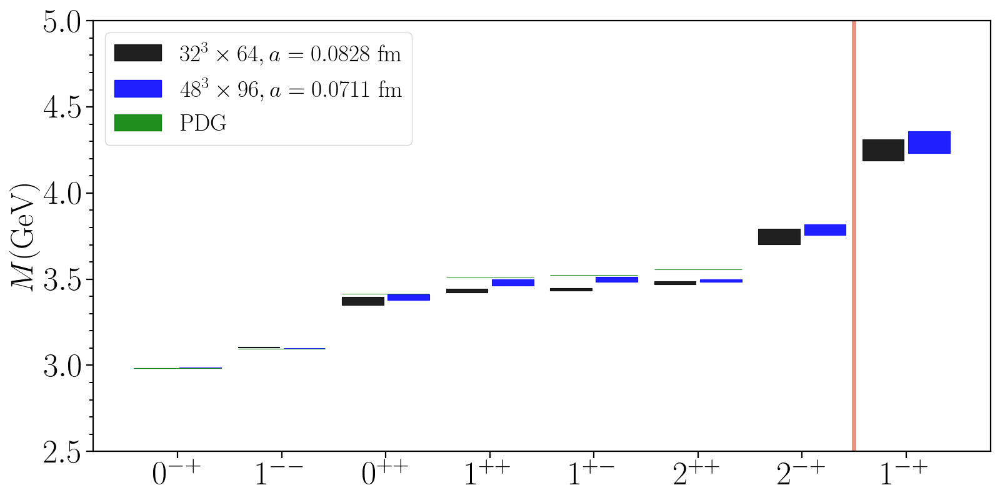

Final fitted results in different $J^{PC}$ channel, here use color boxes to emphasize the final results and the height of the band indicates the statistical error.

**data** directory contains the fitted results from $32^3\times64$ and $48^3\times96$ lattices,
lines labeled `PDG` are the experimental results.

Run `./plot_mass_box.py` will generate the figure in **output** directory.
