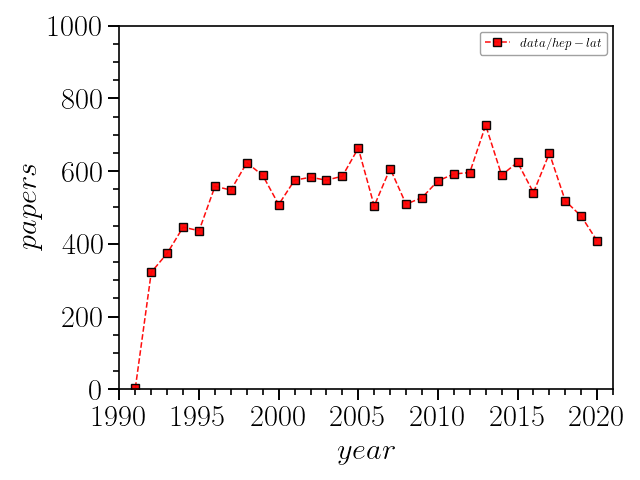
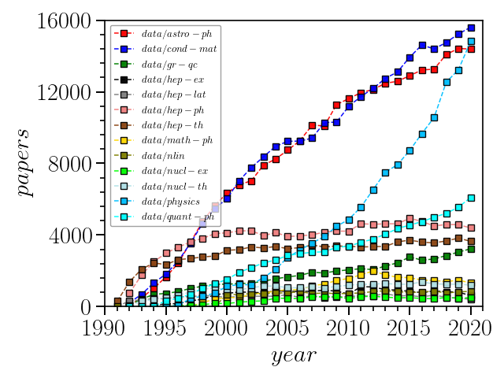

## Example: plot the number of papers per year in different categories on arXiv
---
**data** directory contains the results of numbers of papers per year in different areas under 
**Physics** directory.
### Plot the number of paper for `hep-lat`
Simply plot the number of papers in *High Energy Physics - Lattice* category, i.e. `hep-lat`
```
plotm.py -i data/hep-lat -o output/hep-lat -xl 1990 -xh 2021 -yl 0 -yh 1000 -tkxy 5 1 200 50 -c 0 1 -x "\$year\$" -y "\$papers\$"
```
then there'll be a *png* figure generated under **output** directory,


### Plot all the results on single one figure
Plot all categories' results under **Physics**, i.e. `astro-ph, cond-mat, gr-qc, hep-ex` etc. in one single figure
```
plotm.py -i data/* -o output/physicsall -xl 1990 -xh 2021 -yl 0 -yh 16000 -tkxy 5 1 4000 800 -c 0 1 -x "\$year\$" -y "\$papers\$"
```

