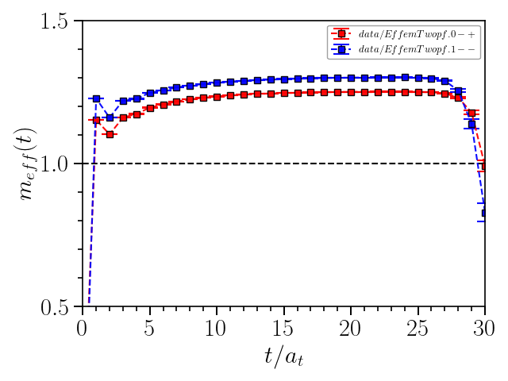
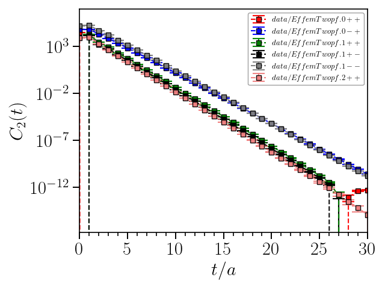

## Example: plot the effective mass
---
### Plot a single channel
**data** directory contains the effective mass and correlation results for charmonium $1S,1P,1D$ states. 
These five columns are time slice, mean value of effective mass, jackknife error of effective mass, mean value of two point function, jackknife error of two point function respectively.
Suppose we'd like to plot the result of $0^{-+}$, then use the command as following
```
plotm.py -i data/EffemTwopf.0-+ -o output/EffemTwopf.0-+ -xl 0 -xh 30 -yl 0 -yh 1.5 -c 0 1 2 -tkxy 5 1 0.5 0.1
```
then there'll be a *png* figure generated under **output** directory,


### Plot $1S(0^{-+},1^{--})$ on one plot
You can also plot the $0^{-+}$ and $1^{--}$ channel on same plot,
and plot a horizontal line at given y-axis position specified with `-hline` option,
```
plotm.py -i data/EffemTwopf.{0-+,1--} -o output/EffemTwopf.1S -xl 0 -xh 30 -yl 0.5 -yh 1.5 -c 0 1 2 -tkxy 5 1 0.5 0.1 -hline 1.0
```


### Plot all the results on single one figure
To plot results from all channels, just use wildcard to match the input filename,
one can also specify the x and y-axis label with `-x` and `-y` option, where the
latex syntax is supported.
```
plotm.py -i data/EffemTwopf.* -o output/EffemTwopf.all -xl 0 -xh 30 -yl 0 -yh 2.0 -c 0 1 2 -tkxy 5 1 0.5 0.1 -hline 1.0
-x "\$t/a\$" -y "\$M_{eff}(t)(\mathrm{GeV})\$"
```


### Plot all the two point functions in log scale on single one figure
Use `-l` to specify the y-axis is in log scale, the two point function is in 3th and 4th-column,
therefore use `-c 0 3 4`
```
plotm.py -i data/EffemTwopf.* -o output/Twopf.all -xl 0 -xh 30 -yl 0 -yh 1e7 -c 0 3 4 -l -x "\$t/a\$" -y "\$C_2(t)\$"
```
